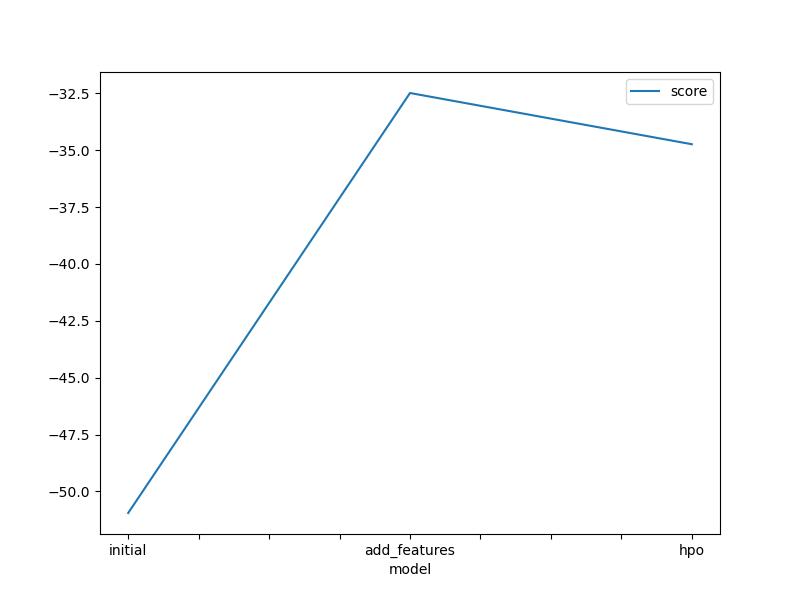
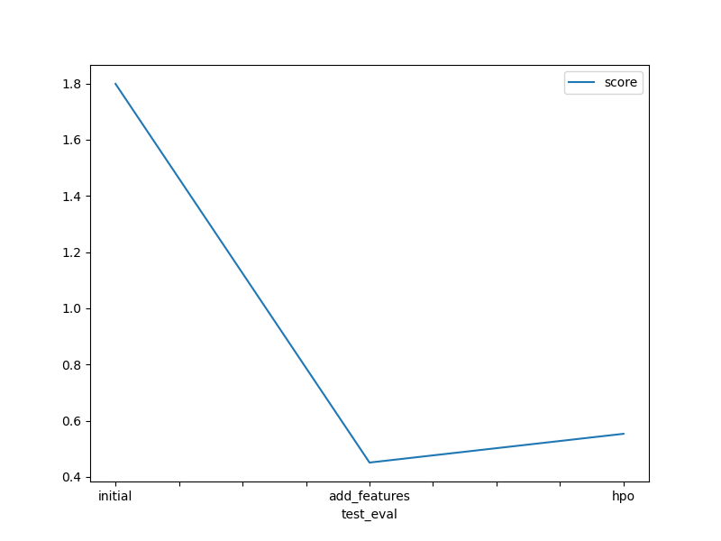

# bike-sharing-demand
 bike-sharing-demand is a kraggle compition
# Report: Predict Bike Sharing Demand with AutoGluon Solution

#### Islam Zewain

## Initial Training

### What did you realize when you tried to submit your predictions? What changes were needed to the output of the predictor to submit your results?

There are some prediction that are negative which is not accepted by Kaggle which is logic too.
I had to detect the predictors less than zero and change them to zero.

### What was the top ranked model that performed?

"WeightedEnsemble_L3" was the model with the highest ranking.

## Exploratory data analysis and feature creation

### What did the exploratory analysis find and how did you add additional features?

EDA was usefult regaring it showed me that I may add new feature drived from the daytime as it looked complex and all dates nearly the same response.
So I decided to drive new features like year, month, day hour, and day of the week.

### How much better did your model preform after adding additional features and why do you think that is?

The model performance was enhanced alot as the score on kaggle was enhanced to nearly 400% from 1.79867 to  0.45127)

## Hyper parameter tuning

### How much better did your model preform after trying different hyper parameters?

It appears that the performance of the model has worsened. Because it was constrained by the hyperparameters that I set, I assume that the space where it was trying to optimize for better results has narrowed down as a result.

### If you were given more time with this dataset, where do you think you would spend more time?

The significance and significance of EDA cannot be overstated.
There are some parameters that I expect to eliminate and some that I will add in the future. 
If there are outliers in the data, it may be necessary to drop some rows based on the values in order to eliminate them from the analysis.

### Create a table with the models you ran, the hyperparameters modified, and the kaggle score.

| model        | hpo1 | hpo2 | hpo3 | score   |
| ------------ | ---- | ---- | ---- | ------- |
| initial      | ?    | ?    | ?    | 1.79867 |
| add_features | ?    | ?    | ?    | 0.45127 |
| hpo          | ?    | ?    | ?    | 0.55359 |

### Create a line plot showing the top model score for the three (or more) training runs during the project.

### Create a line plot showing the top kaggle score for the three (or more) prediction submissions during the project.

## Summary

Autogluon is a good library to start with to know which are the most important features, the suitable machine learning models.
Thereafter, it is a good practice to choose the best model and work separately on it for further training and tuning.

